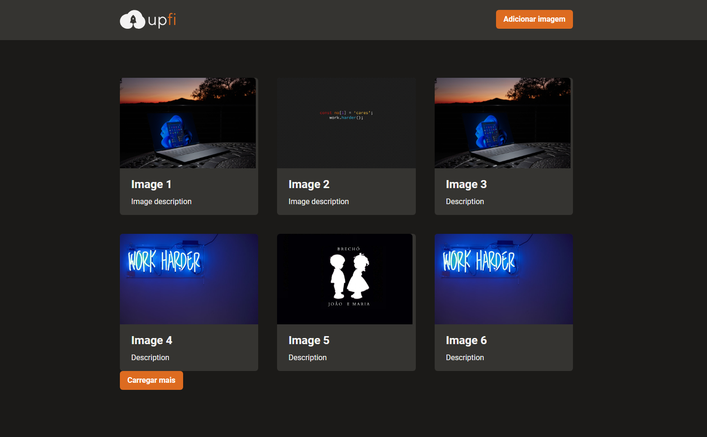

<h1 style="text-align: center; font-weight: bold;">UpFi</h1>

## Demo 📸

<div align="center" >
  
  
</div>

---
## About the project

UpFi is a project where you can upload your images, and they will be stored in [ImgBB](https://pt-br.imgbb.com/) and [FaunaDB](https://fauna.com/)

### 🛠 Technologies

- React
- NextJS
- ChakraUI
- FaunaDB
- React Hook Form
- Yup
- React Query
- TypeScript
- Axios
---

### 🎲 Run

```bash
# Clone this repository
$ git clone https://github.com/NaathanFerreira/upimg.git
# Access the project folder on terminal/cmd
$ cd upimg
# Install dependencies
$ yarn
# or
$ npm install
# Start the application
$ yarn start
# or
$ npm start
```
